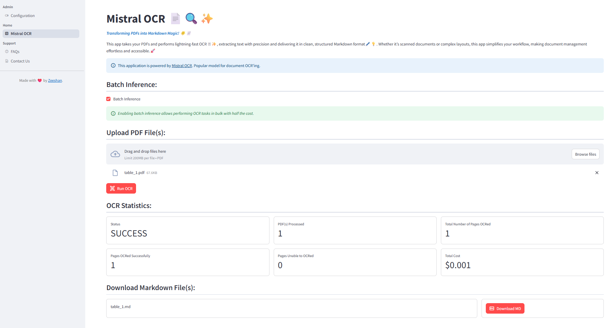
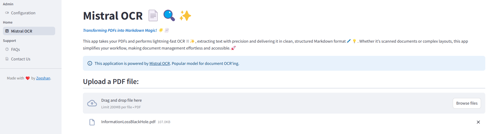
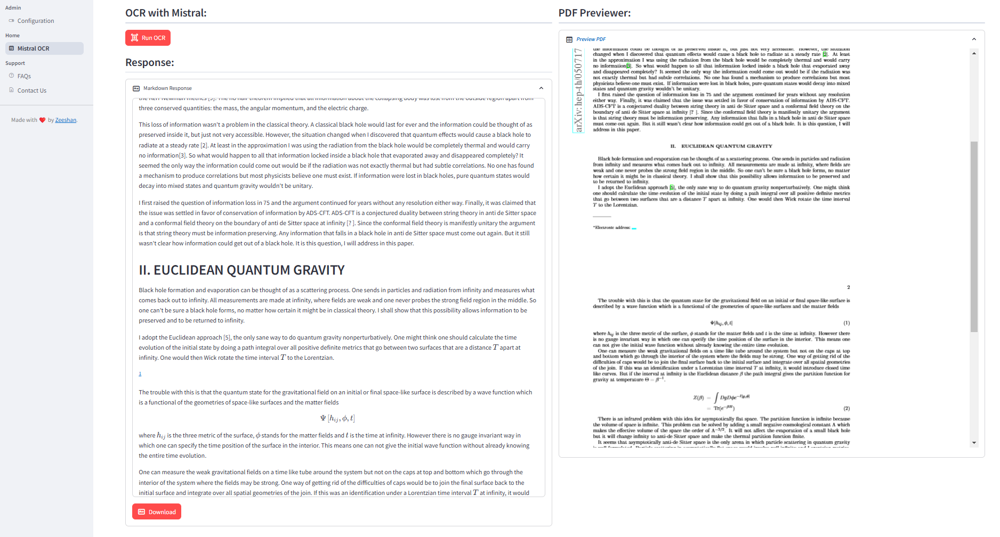

# Mistral OCR 📄🔍✨
Transforming PDFs into Markdown Magic! 🌟📄

This app takes your PDFs and performs lightning-fast OCR 🖹✨, extracting text with precision and delivering it in clean, 
structured Markdown format🖋️💡. With the support of batch inference, one can process multiple PDFs at once, slashing 
cost by half while maintaining the lightning fast speed.

Whether it’s scanned documents or complex layouts, this app simplifies your workflow, making document management 
effortless and accessible.🚀

# Application Link
https://mistral-ocr.streamlit.app/

# Technologies Used
* Streamlit -- Front end development
* mistralai -- Mistral AI model for OCR
   
# System Requirements
You must have Python 3.11 or later installed.

# Installation
1. Clone this repository
2. Create a virtual environment
3. Install the necessary python packages:
   `pip install -r requirements.txt`
4. Run the application with following command from terminal:

   `streamlit run app.py`

# Screen Shots

